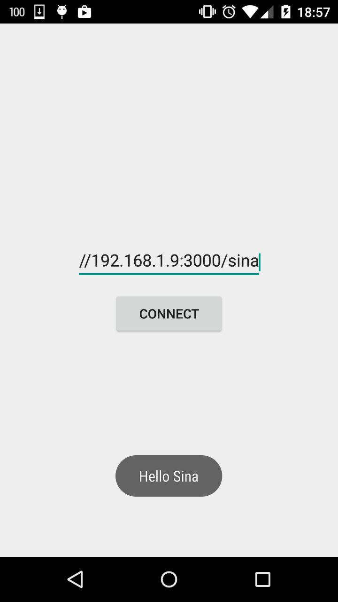

# ali-sina
Simple practice between Sina and I to connect his Android app with back-end express app

## Three apps are available for Sina to call:
- sina : which responces back 'Hello Sina' to his mobile app request
- fortune: which responces back with random fortune string to him; like a fotune cookie :sob:
- database: which returns some objects that I saved in Mongolab

## Instructions
#### Step 1
- Install the Node modules to have dependencies in project directory.
`install npm`
- Run `node server.js`
- Just send a AJAX request to `'/sina'` and `'/fortune'` with your mobile app
- There is nothing really specific on web, really :imp: ,but you can bring it up if you want on browser by typing `localhost:3000`
- Yes, server is on port number `3000`

**Results:**

#### Step 2
- After pulling this repo, once again, you have to type `npm install` to the latest dependencies
- Run `server.js`
- New apps are : `GET('getList')`, `GET('/getList:id')`, `GET('/checker')`, `POST('/add')`, `DELETE('/delete:id')`, `PUT('/modify:id')`
- `/getList` gives you back array of users in json object
- `/getList:id` is a practice to parameters. and it gives you back a user from users list. ID is a parameter that you have to be able to put in your get request
- `/checker/`: is a name checker. If you put `{name: Cyrus}` in the body of your request, you should be able to see  'Right name man!' otherwise you will piss of by `Yo! piece of shit! get away!`, it's kinda user, pass checking.
- `post('/add')`: you are supposed to add someone tp the userlist with this, put new user in req body and sent to server.
- `delete('/delete:id')`: it is like `/getlist:id`, this time server delete the f**ing user with has this ID
- `put('/modify:id')`: It look more complicated, you want to modify the user[id] on the list. So you send id as a param, and new user for modification.

